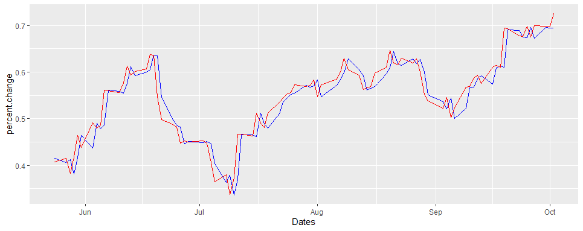
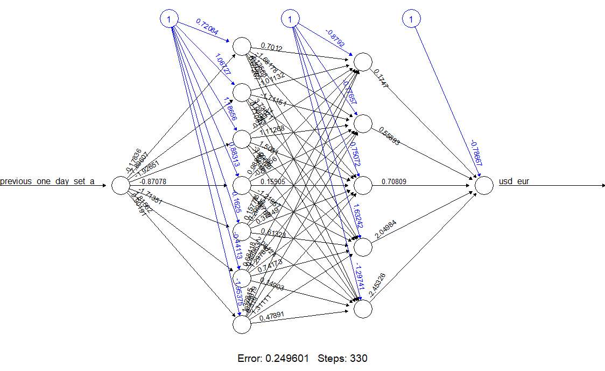

# EUR/USD time series prediction

In this project i have used AR model and nural networks to predct the future value fluctuation of EUR/USD value ratio.

## Autoregressive Model
In autoregression it forecast the variable of interest using a linear combination of past values of the variables. In order to predict a financial value based on it previous values, distribution should depend only on differences of time, not location in time. This are called lags lags are basically like lifted time series and in the model the methodology is predicting yesterday value by looking at today’s value. This is not only done for one particular day and it will continue for the whole time series.
Autoregressive model in order p can be represented as 

```bash
yt=c+ϕ1yt−1+ϕ2yt−2+⋯+ϕpyt−p+εt
```

This can be defined as an AR(p) model, an autoregressive model of order p.
This are called lags. In this project i have created three lags.
They have further divided to three groups to test neural network based on different criteria


## This is finel result as prediction vs actual value

Blue : predicted output \
Red : desired output



## Neural Network Structure used



## R Libraries used

``` R
library(tidyverse)
library(readxl)
library(lubridate)
library(zoo)
library(tidymodels)
library(readxl)
library(neuralnet)
library(knitr)
```
